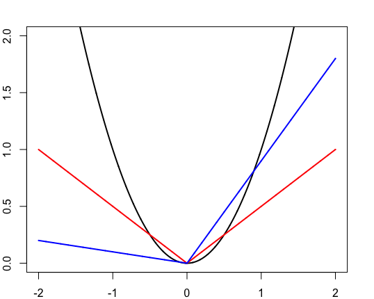

[](http://quantlet.de/)

## [](http://quantlet.de/) **QNN_Loss** [](http://quantlet.de/)

```yaml

Name of QuantLet : QNN_Loss

Published in : 'QNN'

Description : 'Plots the mean squared error, 50% tilted absolute error, 90% tilted absolute error'

Keywords : Quantile regression, loss functions, MSE

See also : 'QNN_QR, NNQR_CoVaR, NNQR_Heat, NNQR_Network, NNQR_SNRI'

Author : Georg Keilbar

Submitted : January 18, 2019 by Georg Keilbar

```



### R Code
```r

library(quantreg)

#Plot the MSE, Median error, 90% ATAE
u=seq(-2,2,0.001)
windows()
par(oma=c(0,0,0,0), mar=c(2,2,2,2))
plot(u,u^2,type="l",xlab="",ylab="",lwd=2,ylim=c(0,2))
lines(u,1/2*abs(u),col="red",lwd=2)
lines(u,0.1*ifelse(u<=0,-u,0)+0.9*ifelse(u>0,u,0),col="blue",lwd=2)
```

automatically created on 2019-01-18